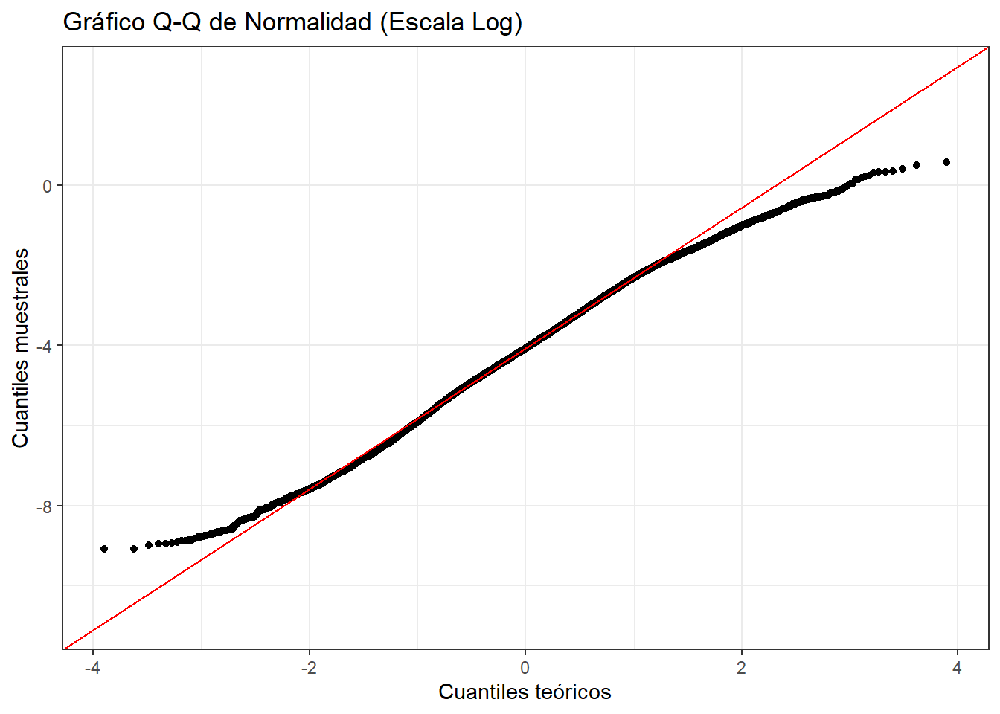

# Carga y Exploración de Datos


``` r
library(readr)
library(dplyr)
library(ggplot2)
library(moments)
library(corrplot)
library(car)

datos <- read_csv("NGACOL.csv")

head(datos)
```

```
## # A tibble: 6 × 11
##   `Hypocenter Depth (km)` Magnitude Rrup_OpenQuake Soil_Class  Tmax origen
##                     <dbl>     <dbl>          <dbl>      <dbl> <dbl> <chr> 
## 1                    7.21       3.4           2.50          2 0.808 NGAW2 
## 2                    7.21       3.4           3.30          3 1.08  NGAW2 
## 3                    7.21       3.4           3.55          3 1.08  NGAW2 
## 4                    7.21       3.4           3.00          3 1.33  NGAW2 
## 5                    8.47       3.4           2.53          3 1.67  NGAW2 
## 6                    8.47       3.4           3.36          2 1.01  NGAW2 
## # ℹ 5 more variables: `Seismic Latitude` <dbl>, `Seismic Longitude` <dbl>,
## #   `Station Latitude` <dbl>, `Station Longitude` <dbl>, T_0.01_RotD50 <dbl>
```


``` r
str(datos)
```

```
## spc_tbl_ [10,239 × 11] (S3: spec_tbl_df/tbl_df/tbl/data.frame)
##  $ Hypocenter Depth (km): num [1:10239] 7.21 7.21 7.21 7.21 8.47 ...
##  $ Magnitude            : num [1:10239] 3.4 3.4 3.4 3.4 3.4 3.4 3.45 3.45 3.45 3.48 ...
##  $ Rrup_OpenQuake       : num [1:10239] 2.5 3.3 3.55 3 2.53 ...
##  $ Soil_Class           : num [1:10239] 2 3 3 3 3 2 3 3 3 3 ...
##  $ Tmax                 : num [1:10239] 0.808 1.081 1.081 1.333 1.667 ...
##  $ origen               : chr [1:10239] "NGAW2" "NGAW2" "NGAW2" "NGAW2" ...
##  $ Seismic Latitude     : num [1:10239] 37.1 37.1 37.1 37.1 36.6 ...
##  $ Seismic Longitude    : num [1:10239] -122 -122 -122 -122 -121 ...
##  $ Station Latitude     : num [1:10239] 37.2 37 36.9 37.2 36.6 ...
##  $ Station Longitude    : num [1:10239] -122 -122 -122 -122 -121 ...
##  $ T_0.01_RotD50        : num [1:10239] -6.82 -6.37 -5.96 -5.32 -2.7 ...
##  - attr(*, "spec")=
##   .. cols(
##   ..   `Hypocenter Depth (km)` = col_double(),
##   ..   Magnitude = col_double(),
##   ..   Rrup_OpenQuake = col_double(),
##   ..   Soil_Class = col_double(),
##   ..   Tmax = col_double(),
##   ..   origen = col_character(),
##   ..   `Seismic Latitude` = col_double(),
##   ..   `Seismic Longitude` = col_double(),
##   ..   `Station Latitude` = col_double(),
##   ..   `Station Longitude` = col_double(),
##   ..   T_0.01_RotD50 = col_double()
##   .. )
##  - attr(*, "problems")=<externalptr>
```

El conjunto de datos tiene **10,239 registros** y **11 variables**.

**Variables categóricas:**

- `Soil_Class`: clase de suelo (valores 1 a 5)
- `origen`: fuente de los datos (NGAW2 o Colombia)

**Variables numéricas:**

- `Magnitude`: magnitud del evento sísmico
- `Rrup_OpenQuake`: distancia a la ruptura (escala logarítmica)
- `Hypocenter Depth (km)`: profundidad del hipocentro
- `T_0.01_RotD50`: aceleración sísmica (escala logarítmica)
- `Seismic Latitude` / `Seismic Longitude`: coordenadas del evento
- `Station Latitude` / `Station Longitude`: coordenadas de la estación
- `Tmax`: periodo máximo registrado

## Valores Faltantes


``` r
colSums(is.na(datos))
```

```
## Hypocenter Depth (km)             Magnitude        Rrup_OpenQuake 
##                     0                     0                     0 
##            Soil_Class                  Tmax                origen 
##                     0                    35                     0 
##      Seismic Latitude     Seismic Longitude      Station Latitude 
##                     0                     0                     0 
##     Station Longitude         T_0.01_RotD50 
##                     0                     0
```

Se identifican **35 valores NA** en la variable `Tmax`. Las demás
variables están completas. Esto se tendrá en cuenta en los análisis
que involucren dicha variable.

## Transformación a Escala Real


``` r
datos <- datos %>%
  mutate(
    Rrup_real = exp(Rrup_OpenQuake),
    Acc_real  = exp(T_0.01_RotD50)
  )

summary(datos$Rrup_real)
```

```
##    Min. 1st Qu.  Median    Mean 3rd Qu.    Max. 
##    0.05   34.93   71.48  105.48  145.28 1532.66
```

``` r
summary(datos$Acc_real)
```

```
##      Min.   1st Qu.    Median      Mean   3rd Qu.      Max. 
## 0.0001128 0.0052669 0.0169618 0.0552774 0.0566147 1.7931580
```

Las variables `Rrup_OpenQuake` y `T_0.01_RotD50` se encuentran en
escala logarítmica natural. Se transforman a su escala física real
mediante la función exponencial, permitiendo interpretar los valores
en unidades originales (km y g respectivamente).

## Prueba de Normalidad


``` r
ggplot(datos, aes(sample = T_0.01_RotD50)) +
  stat_qq() +
  stat_qq_line(color = "red") +
  labs(title = "Gráfico Q-Q de Normalidad (Escala Log)",
       x = "Cuantiles teóricos",
       y = "Cuantiles muestrales") +
  theme_bw()
```



El gráfico Q-Q muestra que los datos en escala logarítmica se ajustan
razonablemente bien a la línea de referencia normal (en rojo), con
ligeras desviaciones en las colas. El comportamiento es consistente
con la distribución log-normal ampliamente reportada en la literatura
sísmica.

## Prueba de Homocedasticidad


``` r
leveneTest(T_0.01_RotD50 ~ factor(Soil_Class), data = datos)
```

```
## Levene's Test for Homogeneity of Variance (center = median)
##          Df F value    Pr(>F)    
## group     4  31.792 < 2.2e-16 ***
##       10234                      
## ---
## Signif. codes:  0 '***' 0.001 '**' 0.01 '*' 0.05 '.' 0.1 ' ' 1
```

La prueba de Levene indica evidencia estadística de
**heterocedasticidad** entre clases de suelo (p < 0.05). La varianza
de la aceleración no es igual en todos los tipos de suelo, lo cual
tiene implicaciones importantes para modelos estadísticos que asuman
varianza constante.

## Prueba de Correlación (Pearson)


``` r
cor.test(datos$Rrup_OpenQuake, datos$T_0.01_RotD50, method = "pearson")
```

```
## 
## 	Pearson's product-moment correlation
## 
## data:  datos$Rrup_OpenQuake and datos$T_0.01_RotD50
## t = -48.189, df = 10237, p-value < 2.2e-16
## alternative hypothesis: true correlation is not equal to 0
## 95 percent confidence interval:
##  -0.4456573 -0.4140782
## sample estimates:
##        cor 
## -0.4299992
```

El coeficiente de correlación de Pearson es **r = -0.43**, indicando
una relación lineal negativa moderada entre la distancia y la
aceleración. El intervalo de confianza al 95% (-0.446, -0.414)
confirma que la correlación es estadísticamente diferente de cero
(p < 0.001). Esta relación negativa es consistente con el fenómeno
de **atenuación sísmica**: a mayor distancia a la fuente, menor
aceleración registrada.
