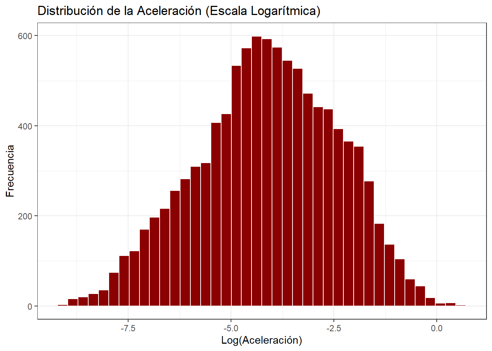
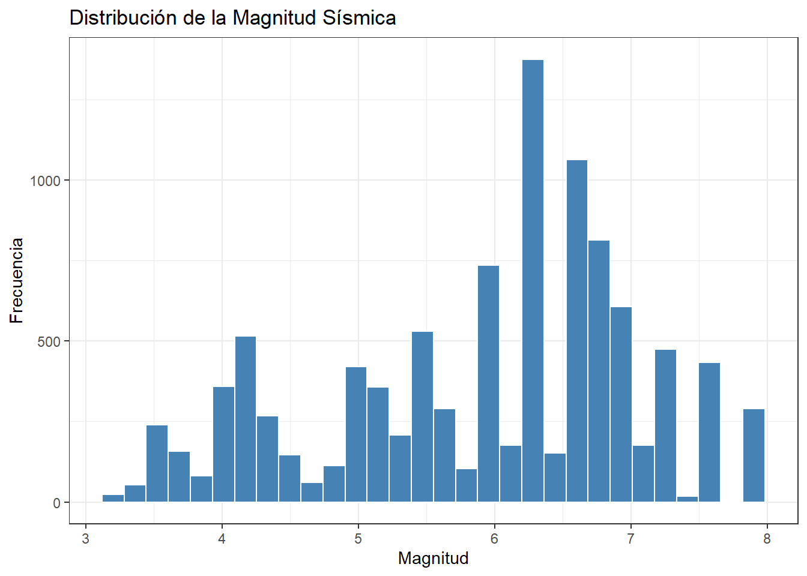
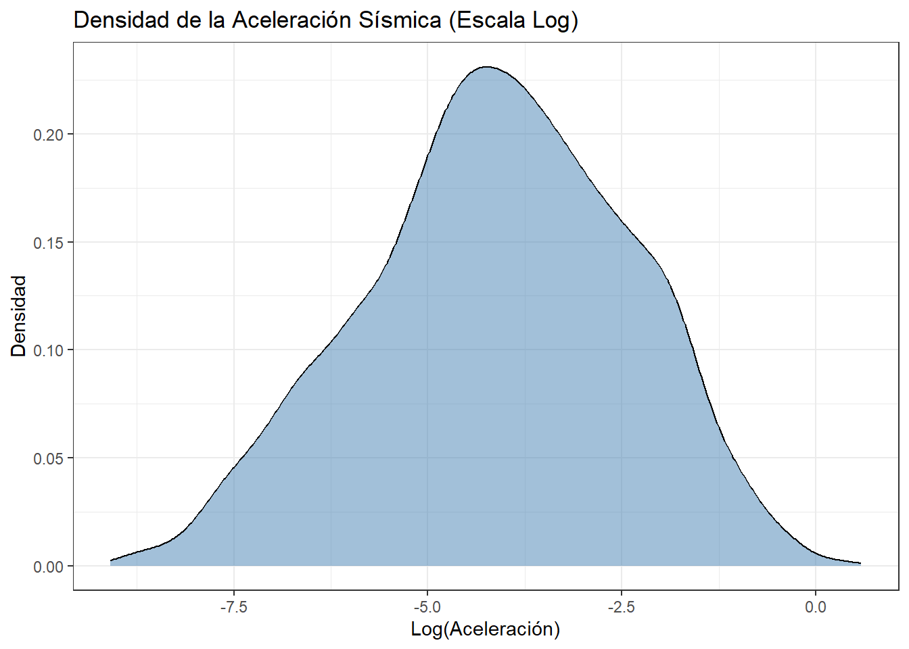
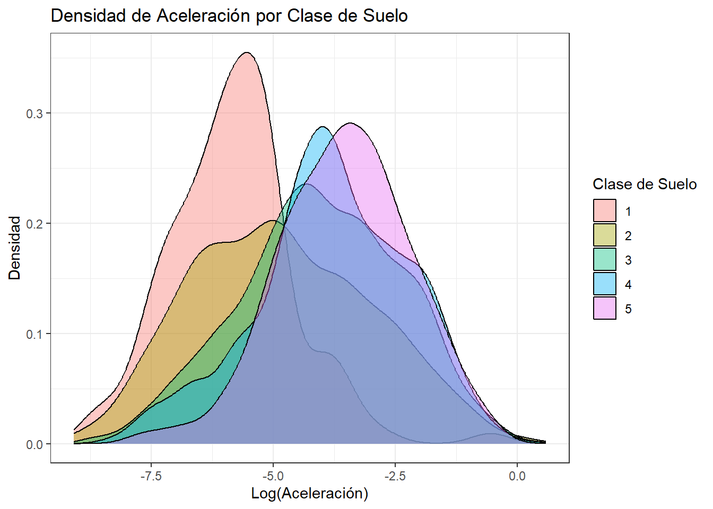

``` r
library(readr)
library(dplyr)
library(ggplot2)
library(moments)
datos <- read_csv("NGACOL.csv") %>%
  mutate(
    Rrup_real = exp(Rrup_OpenQuake),
    Acc_real  = exp(T_0.01_RotD50)
  )
```

# Visualización de Variables Continuas

Las variables continuas se visualizan con histogramas, gráficos de
densidad y estadísticas de resumen, que permiten entender su
distribución y detectar asimetrías o valores extremos.

## Distribución de la Aceleración


``` r
ggplot(datos, aes(x = T_0.01_RotD50)) +
  geom_histogram(bins = 40, fill = "darkred", color = "white") +
  labs(title = "Distribución de la Aceleración (Escala Logarítmica)",
       x = "Log(Aceleración)",
       y = "Frecuencia") +
  theme_bw()
```



**Interpretación:** La distribución en escala logarítmica muestra una
forma aproximadamente simétrica y unimodal, centrada alrededor de -4,
lo que es consistente con un comportamiento log-normal.

## Distribución de la Magnitud


``` r
ggplot(datos, aes(x = Magnitude)) +
  geom_histogram(bins = 30, fill = "steelblue", color = "white") +
  labs(title = "Distribución de la Magnitud Sísmica",
       x = "Magnitud",
       y = "Frecuencia") +
  theme_bw()
```



**Interpretación:** La magnitud presenta mayor concentración entre 5
y 7, con pocos eventos de magnitud muy alta (> 7.5). Esto es típico
de bases de datos sísmicas instrumentales donde los eventos moderados
son más frecuentes que los grandes terremotos.

## Estadísticas de Resumen (Escala Logarítmica)


``` r
resumen_log <- datos %>%
  summarise(
    n           = n(),
    media_log   = mean(T_0.01_RotD50, na.rm = TRUE),
    mediana_log = median(T_0.01_RotD50, na.rm = TRUE),
    sd_log      = sd(T_0.01_RotD50, na.rm = TRUE),
    min_log     = min(T_0.01_RotD50, na.rm = TRUE),
    Q1_log      = quantile(T_0.01_RotD50, 0.25, na.rm = TRUE),
    Q3_log      = quantile(T_0.01_RotD50, 0.75, na.rm = TRUE),
    max_log     = max(T_0.01_RotD50, na.rm = TRUE),
    IQR_log     = IQR(T_0.01_RotD50, na.rm = TRUE),
    asimetria   = skewness(T_0.01_RotD50, na.rm = TRUE),
    curtosis    = kurtosis(T_0.01_RotD50, na.rm = TRUE)
  )

resumen_log
```

```
## # A tibble: 1 × 11
##       n media_log mediana_log sd_log min_log Q1_log Q3_log max_log IQR_log
##   <int>     <dbl>       <dbl>  <dbl>   <dbl>  <dbl>  <dbl>   <dbl>   <dbl>
## 1 10239     -4.12       -4.08   1.70   -9.09  -5.25  -2.87   0.584    2.37
## # ℹ 2 more variables: asimetria <dbl>, curtosis <dbl>
```

**Interpretación:** La media logarítmica es de aproximadamente -4.12
y la mediana de -4.08, valores muy cercanos entre sí, confirmando la
simetría relativa de la distribución. La asimetría cercana a cero y
la curtosis mayor a 3 indican colas ligeramente más pesadas que una
distribución normal estándar.

## Estadísticas de Resumen (Escala Real)


``` r
datos %>%
  summarise(
    media_g   = mean(Acc_real),
    sd_g      = sd(Acc_real),
    mediana_g = median(Acc_real),
    min_g     = min(Acc_real),
    max_g     = max(Acc_real)
  )
```

```
## # A tibble: 1 × 5
##   media_g  sd_g mediana_g    min_g max_g
##     <dbl> <dbl>     <dbl>    <dbl> <dbl>
## 1  0.0553 0.108    0.0170 0.000113  1.79
```

## Densidad de la Aceleración


``` r
datos %>%
  ggplot(aes(x = T_0.01_RotD50)) +
  geom_density(fill = "steelblue", alpha = 0.5) +
  labs(title = "Densidad de la Aceleración Sísmica (Escala Log)",
       x = "Log(Aceleración)",
       y = "Densidad") +
  theme_bw()
```



## Densidad por Clase de Suelo


``` r
datos %>%
  ggplot(aes(x = T_0.01_RotD50, fill = factor(Soil_Class))) +
  geom_density(alpha = 0.4) +
  labs(title = "Densidad de Aceleración por Clase de Suelo",
       x = "Log(Aceleración)",
       y = "Densidad",
       fill = "Clase de Suelo") +
  theme_bw()
```



**Interpretación:** Las curvas de densidad por clase de suelo muestran
distribuciones similares pero con ligeros desplazamientos en la media,
lo que sugiere un efecto moderado del tipo de suelo sobre la
aceleración registrada.
