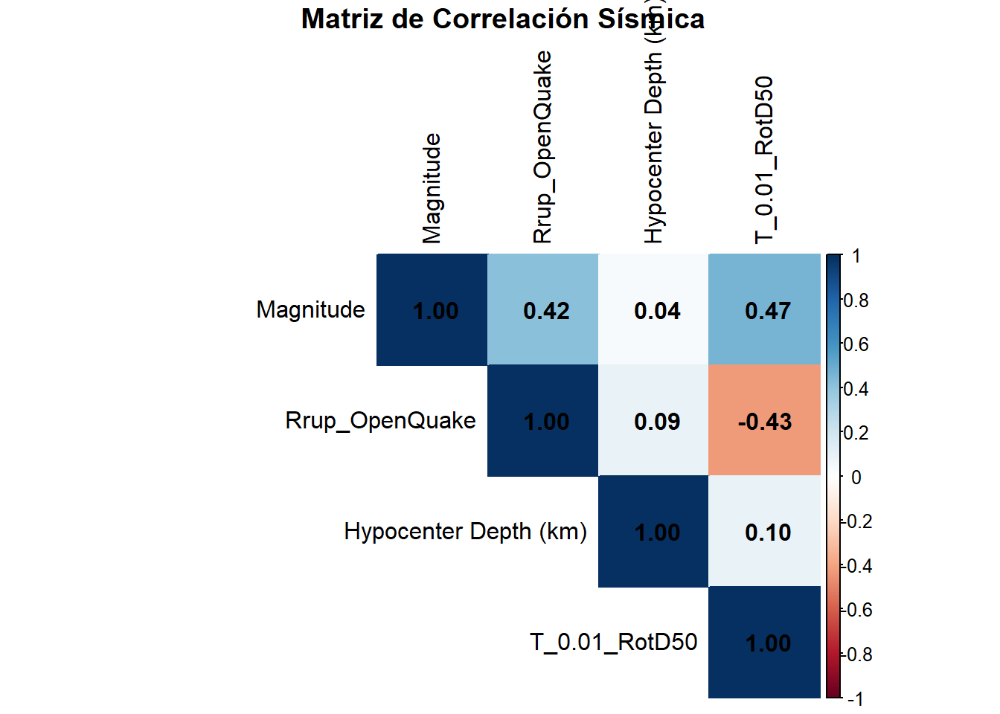

``` r
library(readr)
library(dplyr)
library(ggplot2)
library(corrplot)


datos <- read_csv("NGACOL.csv") %>%
  mutate(
    Rrup_real = exp(Rrup_OpenQuake),
    Acc_real  = exp(T_0.01_RotD50)
  )
```

# Correlación de Variables Sísmicas

Un gráfico de correlación es una representación visual de la matriz
de correlaciones entre variables numéricas. Facilita identificar
relaciones lineales fuertes, positivas o negativas.

## Matriz de Correlación


``` r
vars_sismicas <- datos %>%
  select(Magnitude, Rrup_OpenQuake, `Hypocenter Depth (km)`, T_0.01_RotD50)

matriz_cor <- cor(vars_sismicas, use = "complete.obs")

print(round(matriz_cor, 3))
```

```
##                       Magnitude Rrup_OpenQuake Hypocenter Depth (km)
## Magnitude                 1.000          0.417                 0.036
## Rrup_OpenQuake            0.417          1.000                 0.090
## Hypocenter Depth (km)     0.036          0.090                 1.000
## T_0.01_RotD50             0.468         -0.430                 0.096
##                       T_0.01_RotD50
## Magnitude                     0.468
## Rrup_OpenQuake               -0.430
## Hypocenter Depth (km)         0.096
## T_0.01_RotD50                 1.000
```

## Heatmap de Correlación


``` r
corrplot(matriz_cor, method = "color", addCoef.col = "black",
         type = "upper", tl.col = "black",
         title = "\n Matriz de Correlación Sísmica")
```



**Interpretación:** La correlación más fuerte es entre
`Rrup_OpenQuake` y `T_0.01_RotD50` (r = -0.43), confirmando la
atenuación sísmica. La magnitud presenta correlación positiva
moderada con la aceleración (r ≈ 0.38): eventos más grandes generan
mayor aceleración. La profundidad muestra correlación débil con
las demás variables.
