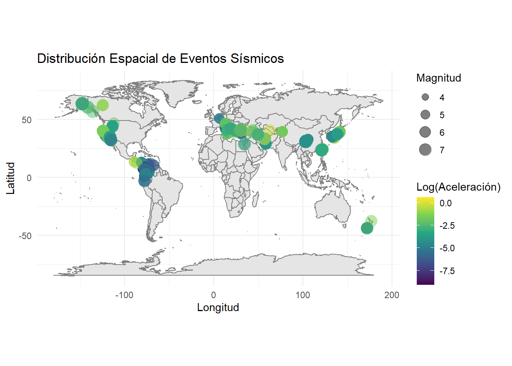

``` r
library(readr)
library(dplyr)
library(ggplot2)

datos <- read_csv("NGACOL.csv") %>%
  mutate(
    Rrup_real = exp(Rrup_OpenQuake),
    Acc_real  = exp(T_0.01_RotD50)
  )
```

# Distribución Espacial de Eventos Sísmicos

La visualización espacial permite identificar patrones geográficos
en los registros y detectar si existen zonas con mayor actividad
o mayor aceleración registrada.

## Mapa de Eventos Sísmicos


``` r
ggplot(datos, aes(x = `Seismic Longitude`, y = `Seismic Latitude`)) +
  borders("world", colour = "gray50", fill = "gray90") +
  geom_point(aes(size = Magnitude, color = T_0.01_RotD50),
             alpha = 0.5,
             na.rm = TRUE) +
  scale_color_viridis_c() +
  coord_fixed(1.3) +
  labs(title = "Distribución Espacial de Eventos Sísmicos",
       x = "Longitud",
       y = "Latitud",
       size = "Magnitud",
       color = "Log(Aceleración)") +
  theme_minimal()
```



**Interpretación:** La mayoría de los eventos proviene de la costa
oeste de los Estados Unidos (California, Oregon, Washington), con
un pequeño grupo de registros en Colombia. Los eventos de mayor
magnitud no necesariamente coinciden con las mayores aceleraciones
registradas, dado que la distancia a la estación juega un papel
fundamental en la atenuación.
